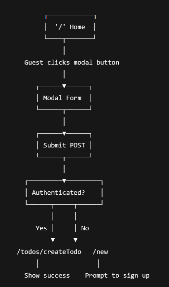
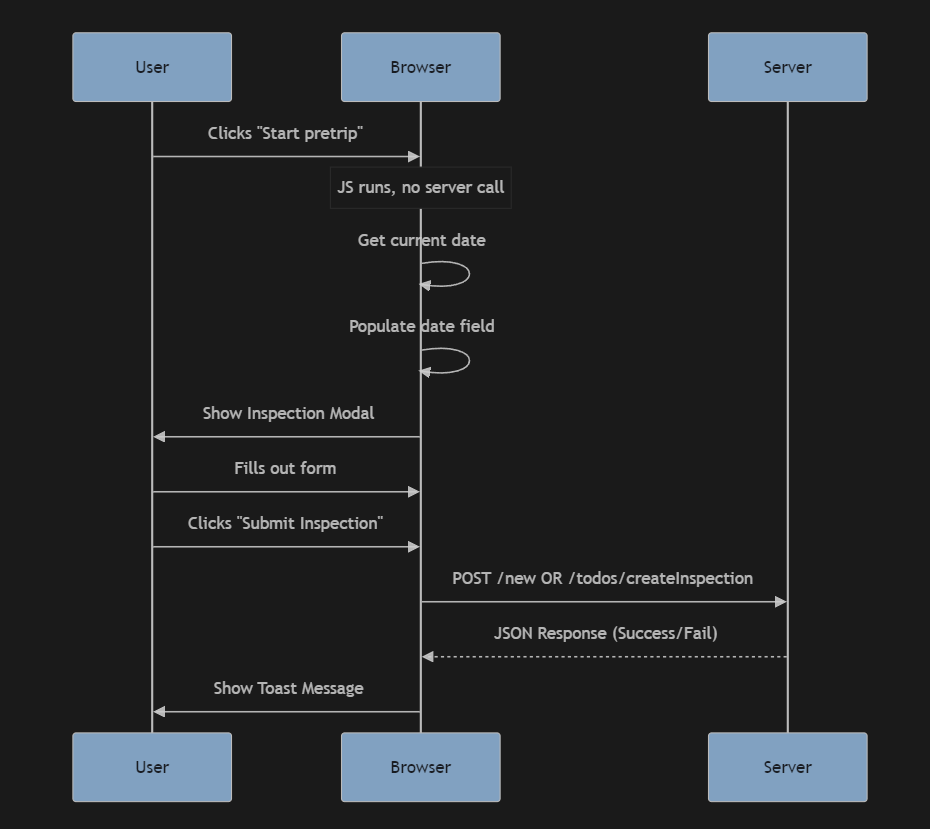
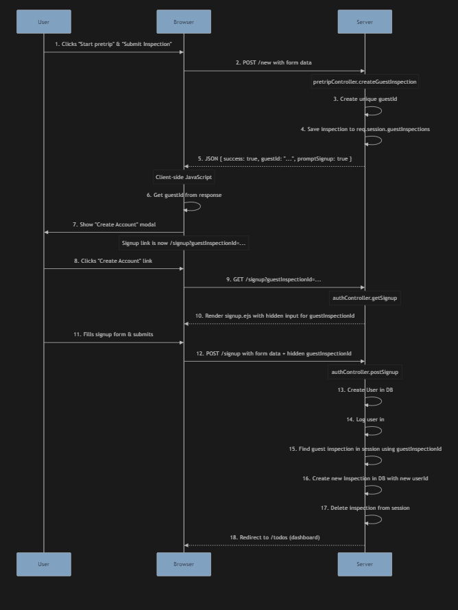

## Description
A full-stack web application that is deployed with Railway. Under development

Deployed on Railway: https://pretriq.up.railway.app/

## Demo

## Optimizations 
* Style landing page
* Style signup/login page
* Convert to PWA
* Implement Tesseract for OCR & Quagga2/ZXing for scanning
* Implement html2canvas & jsPDF
* Implement a 'recent activity' feed
* Add SEO
* Optimize for accessibility & screen readers
* Optimize pageload

### Tech used:

## Lessons learned
This project has shown me that learning & understanding is displayed through building. 
There are several features I have seen for the first time. I had to learn more about it and implement in a way that fits the codebase in this project.
I experienced an undescribable feeling where I have watched this project grow from a blank page to where its at now. 
It came a long way and there is still so much more that can be added and improved on. 
I envision that this application has potential to become something with a global reach.

## Version History 
---------------------------------------------------------------------------------------------------------------------------
# 🛠️ pretriq Patch 1.3 — Hero section
📅 **Release Date:** June 25, 2025

---

## 📢 Developer's Notes - **Using Canva AI to generate images & using Canvas to make a dynamic background**

- I used ChatGPT to describe the image as a prompt then used the prompt on an AI image generator. Came out solid
- You ever watch cartoons and get the joke later in life? Yeah same, but with my on-demand-background-picker project. It even says it in the title
  - Used canvas API to display bouncing letters over the screen

---------------------------------------------------------------------------------------------------------------------------
---------------------------------------------------------------------------------------------------------------------------
# 🛠️ pretriq Patch 1.2 — Form data to PDF - programmatically placing text
📅 **Release Date:** June 24, 2025

---

## 📢 Developer's Notes - **Using jsPDF & html2canvas, sanitize sanitize sanitize, adding confetti, updating profile page**

- learning how to programmatically display text with jspdf was fun - definitely see this being used in real worlds situations
- I am validating and sanitizing any thing possible, I want this app to be secure
- confetti now shows up when completing an inspection!

---------------------------------------------------------------------------------------------------------------------------
---------------------------------------------------------------------------------------------------------------------------
# 🛠️ pretriq Patch 1.1 — Google Analytics, Logo & Semantic HTML
📅 **Release Date:** June 23, 2025

---

## 📢 Developer's Notes - **serving error code 404 & 500 pages, visualizing data with Google Analytics, deciding on pretriq logo, adding social media links, using semantic HTML**

- I didn't know your server had to serve 404 and 500 status code pages
- Using Google Analytics to collect data was surprisingly very easy to implement
- I added my social media links if any users want to give feedback on how to improve the app or bring bugs to my attention

I picked the logo that looked like eyes

---------------------------------------------------------------------------------------------------------------------------
---------------------------------------------------------------------------------------------------------------------------
# 🛠️ pretriq Patch 1.0 — MVP & newsletter - live & launched
📅 **Release Date:** June 22, 2025

---

## 📢 Developer's Notes - **creating pre-trip reports digitally, optimizing, validating & sanitizing, displaying dynmic content, newsletter functionality**

- The code I pushed on this day was extremely productive. I decided to put a pin in Guest-User-Flow and focus on the authenticated side. We skipped about .6 version numbers, and that is because the Minimum Viable Product stage has been achieved.
  - This full-stack web application is deployed live on Railway and can support users with account creation. The main functionality is tucked away in a member's-only area (for now) where free users can conduct a Driver's Vehicle Inspection Report digitally. This report is saved to the user's account and securely stored on the MongoDB Database. More features and user-interactivity will be coming as I intend to use this web application.
- The modal with the pretrip report is on POST route and I have validated and sanitized the input using the express-validator library.
- The member's-only area now displays dynamic content and shows your documents that's stored in MongoDB.
- The newsletter works, so if you enter an email in there, that gets saved into the database too.
- I moved all my client-side javascript away from my HTML so stuff should be smoother/faster.
  - I also cleaned up a lot of unused controller functions on the server side.
  
Well. There's still so much I want to build for this project, so stay tuned

---------------------------------------------------------------------------------------------------------------------------
---------------------------------------------------------------------------------------------------------------------------
# 🛠️ pretriq Patch 0.4 — MVP functionality testing
📅 **Release Date:** June 21, 2025

---

## 📢 Developer's Notes - **newsletter cosmetic update & MVP Testing**
- The code I pushed on this day was not productive.
- I spent several hours doing pseudocode, building & debugging. I ended the night by deleting everything I had just spent more than half the day working on. I was working on creating a Guest-User-Flow which allowed a non-authenticated user to conduct a pre-trip inspection report. The user would submit the report and be prompted to either create an account or continue as a guest. This is where all the pseudocode & theory craft came in. I decided to use session storage to store guestId token after the user completed a report. Even if the user decided to signup at the prompt or later, the backend logic would search for the token if it existed and compare it. Also the document which represents stored inspection reports was not being stored in my collection.

I'd solve one thing and three more thing would arise. I rage quit.
Here are some images of my Guest-User-Flow:

---------------------------------------------------------------------------------------------------------------------------
---------------------------------------------------------------------------------------------------------------------------
# 🛠️ pretriq Patch 0.3 — Frontend overhaul
📅 **Release Date:** June 17, 2025

---

## 📢 Developer's Notes - **RGB button, optimizations, newsletter glow up**
- The code I pushed on this day was front-end heavy.
- During the pandemic, I visited a local businesses website and saw a button on their webpage-- yup you guessed it, the button had a rotating gradient ring border. Looked exactly like RGB lights flowing clockwise around a button. I didn't copy the exact code, but copied the concept.
- The previous newsletter section I made was actually an image. It wasn't even styled. Just an input element with a image behind it. I thought it looked good.
- I optimized the app by removing unused code and added ARIA label/roles to assist with screen reader accessibility.

---------------------------------------------------------------------------------------------------------------------------
---------------------------------------------------------------------------------------------------------------------------
# 🛠️ pretriq Patch 0.2 — rebranding
📅 **Release Date:** June 16, 2025

---

## 📢 Developer's Notes - **change bo-tow name & domain name to pretriq, sunset Quagga2 idea, try new idea-- digital pre-trip inspections**
- The code I pushed on this day was minor.
- Mainly changed the name from bo-tow to pretriq.
  - This web application initially began as an idea to create an "Uber" for tow truck operators to do gig work and perform roadside assistance for users. The scope of this project is bigger than I could ever imagine.
- I wanted to create an application that I could use for work.
  - My idea was to make an inventory management system with scanner functionality using Quagga2.
    - It worked but it was not practical IRL and made inventory take longer.

---------------------------------------------------------------------------------------------------------------------------
---------------------------------------------------------------------------------------------------------------------------
# 🛠️ pretriq Patch 0.1 — Reviving the project
📅 **Release Date:** June 12, 2025

---

## 📢 Developer's Notes - **local environment setup, install validator, update User schema, re-deploying on Railway, updating local-auth to resume sign ups, and play with Quagga2**  
- The code I pushed on this day was mainly to get the website back online.
- Everything was broken and I started with fixing bugs with account creation and storing the newly-created account into MongoDB.
- I revived this web application with the intention to make it as secure as I have learned--
  - so I used the validator library to validate email during signup.
- I temporarily named the domain "whwh".

---------------------------------------------------------------------------------------------------------------------------